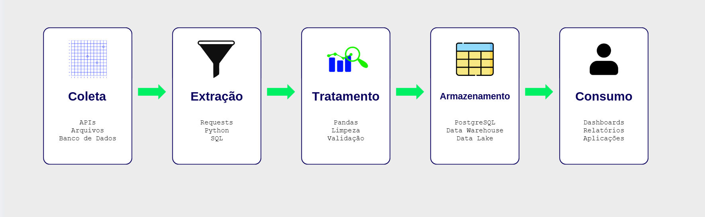

# Semana 1 - Fundamentos de Engenharia de Dados

## Introdução

Vivemos em uma era em que dados são gerados constantemente por aplicações, dispositivos e diversos sistemas computacionais. No entanto, para que essas informações possam gerar valor para uma organização, é necessário que sejam coletadas, organizadas, processadas e disponibilizadas de maneira confiável.

É nesse contexto que surge a Engenharia de Dados, uma área responsável por construir toda a infraestrutura necessária para que os dados possam ser utilizados para análises e tomada de decisão.

Na primeira semana serão apresentados os conceitos fundamentais da área, abordando o papel do engenheiro de dados, o ciclo de vida dos dados, pipelines de processamento e uma introdução ao uso da linguagem Python com a biblioteca Pandas para manipulação de dados.


# 1. Papel do Engenheiro de Dados

## O papel do Engenheiro de Dados

O Engenheiro de Dados é o profissional responsável por projetar, desenvolver e manter a infraestrutura necessária para o armazenamento e processamento de dados. Seu trabalho garante que informações provenientes de diferentes fontes possam ser utilizadas de forma consistente, segura e eficiente.

Entre suas principais responsabilidades estão:

- coletar dados de diferentes fontes, como APIs, bancos de dados e arquivos;
- desenvolver pipelines de dados;
- garantir a qualidade e integridade dos dados;
- definir soluções de armazenamento;
- disponibilizar os dados para equipes de análise e tomada de decisão.

## Analista x Cientista x Engenheiro

Embora analistas, cientistas e engenheiros de dados trabalhem com o mesmo recurso, cada um possui responsabilidades diferentes dentro do processo de geração de valor.

O engenheiro de dados é responsável por construir e manter a infraestrutura que permite a coleta, o processamento, o armazenamento e a disponibilização dos dados. Seu foco está em garantir que as informações sejam confiáveis, organizadas e acessíveis para as demais equipes.

O analista de dados utiliza essas informações para produzir relatórios, dashboards e indicadores que auxiliam a tomada de decisão da empresa. Já o cientista de dados busca extrair conhecimento dos dados por meio de técnicas estatísticas e algoritmos de aprendizado de máquina, desenvolvendo modelos capazes de identificar padrões e realizar previsões.

Dessa forma, essas três funções são complementares: enquanto o engenheiro prepara e disponibiliza os dados, analistas e cientistas os utilizam para gerar insights e apoiar decisões estratégicas.

| Profissional | Principal responsabilidade |
| :------------ | :------------------------- |
| **Engenheiro de Dados** | Coleta, integra, transforma, armazena e disponibiliza dados para consumo. |
| **Analista de Dados** | Explora os dados para gerar relatórios, dashboards e indicadores que apoiam a tomada de decisão. |
| **Cientista de Dados** | Desenvolve modelos estatísticos e de aprendizado de máquina para identificar padrões e realizar previsões. |

# 2. Ciclo de Vida dos Dados

Os dados percorrem diferentes etapas antes de serem utilizados. Esse processo é conhecido como **Ciclo de Vida dos Dados**.

De maneira geral, esse ciclo pode ser dividido em cinco etapas:



- **Coleta:** É a etapa responsável por obter dados provenientes de diferentes fontes, como APIs, bancos de dados e arquivos

- **Extração:** Após identificar a fonte, os dados precisam ser recuperados para que possam ser processados. Essa extração pode ser realizada utilizando linguagens como Python, consultas SQL ou bibliotecas específicas para acesso a serviços externos.

- **Tratamento:** Os dados coletados raramente estão prontos para uso. Nesta etapa são realizadas operações de limpeza, padronização, validação e transformação, removendo inconsistências e preparando as informações para análise.

- **Armazenamento:** Após o processamento, os dados são armazenados em ambientes apropriados, como bancos de dados, Data Warehouses ou Data Lakes, possibilitando seu acesso por diferentes aplicações.

- **Consumo:** Na etapa final, os dados tornam-se disponíveis para dashboards, relatórios e demais aplicações que auxiliam a tomada de decisão.


# 3. Visão Geral de Pipelines de Dados

Grande parte das atividades realizadas por um engenheiro de dados ocorre por meio de **pipelines de dados**, que pode ser entendido como um fluxo automatizado responsável por transportar dados entre diferentes sistemas, realizando todas as transformações necessárias até que estejam prontos para utilização.

Em um pipeline, é comum encontrar três etapas principais:

- **Extração (Extract):** obtenção dos dados na fonte de origem;
- **Transformação (Transform):** limpeza, padronização e enriquecimento das informações;
- **Carga (Load):** armazenamento dos dados no ambiente de destino.

Esse processo é conhecido como **ETL (Extract, Transform and Load)**. Também é comum utilizar o modelo **ELT (Extract, Load and Transform)**, no qual os dados são carregados primeiro e transformados posteriormente.

Além de automatizar tarefas repetitivas, um pipeline deve garantir:

- automação da execução;
- reprodutibilidade dos resultados;
- validação da qualidade dos dados;
- tratamento de possíveis erros durante o processamento.


# 4. Introdução ao Python e à Biblioteca Pandas

Uma das bibliotecas mais utilizadas para manipulação de dados é o **Pandas**, que oferece estruturas de dados e funções para leitura, transformação e análise de conjuntos de dados.

Sua importação é realizada da seguinte forma:

```python
import pandas as pd
```

A principal estrutura da biblioteca é o **DataFrame**, que representa uma tabela organizada em linhas e colunas, semelhante a uma planilha ou a uma tabela de banco de dados.


## 4.1. Leitura e Escrita de Arquivos

Uma das principais funcionalidades do Pandas é permitir a leitura e escrita de diferentes formatos de arquivos.

### Arquivos CSV

O formato CSV (*Comma-Separated Values*) é um dos mais utilizados para armazenamento e troca de dados tabulares.

```python
df = pd.read_csv("dados.csv")
```

Para salvar um DataFrame nesse formato:

```python
df.to_csv("saida.csv", index=False)
```

### Arquivos JSON

O formato JSON é amplamente utilizado para troca de informações entre aplicações e serviços web.

```python
df = pd.read_json("dados.json")
```

Também é possível exportar dados utilizando:

```python
df.to_json("saida.json")
```

### Arquivos TXT

Arquivos de texto podem possuir diferentes formatos de separação. Dependendo da estrutura do arquivo, é possível utilizar `read_csv()` especificando o separador adequado.

```python
df = pd.read_csv("dados.txt", sep=";")
```

### Arquivos Excel

Planilhas do Microsoft Excel também podem ser manipuladas utilizando o Pandas.

```python
df = pd.read_excel("dados.xlsx")
```

Para exportar:

```python
df.to_excel("saida.xlsx", index=False)
```


## 4.2. Exploração de Dados

Após carregar um conjunto de dados em um DataFrame, normalmente o primeiro passo é explorar sua estrutura e verificar se as informações foram importadas corretamente. O Pandas oferece diversas funções que auxiliam nessa etapa inicial de análise.


### Visualizando os primeiros registros

A função `head()` exibe, por padrão, as cinco primeiras linhas do DataFrame, permitindo uma visualização rápida da estrutura dos dados.

```python
df.head()
```

Também é possível especificar a quantidade de linhas desejada.

```python
df.head(10)
```

### Obtendo informações gerais

A função `info()` apresenta um resumo do DataFrame, incluindo o número de linhas, colunas, tipos de dados e a quantidade de valores não nulos em cada coluna.

```python
df.info()
```

Essa função é útil para identificar colunas com valores ausentes ou tipos de dados incorretos.

### Gerando estatísticas descritivas

A função `describe()` calcula estatísticas básicas das colunas numéricas do DataFrame.

```python
df.describe()
```

Entre as informações apresentadas estão:

- **count:** quantidade de valores válidos;
- **mean:** média dos valores;
- **std:** desvio padrão;
- **min:** menor valor encontrado;
- **25%, 50% e 75%:** quartis da distribuição;
- **max:** maior valor encontrado.

Essas estatísticas fornecem uma visão geral da distribuição dos dados e auxiliam na identificação de possíveis inconsistências.

### Seleção de colunas

É possível acessar uma ou mais colunas de um DataFrame utilizando seus nomes.

```python
df["Nome"]
```

ou

```python
df[["Nome", "Idade"]]
```


### Filtrando dados

Filtros permitem selecionar apenas os dados que atendem a determinada condição.

```python
df[df["Idade"] >= 18]
```


### Tratamento de valores nulos

Durante a manipulação dos dados, é comum encontrar valores ausentes. O Pandas oferece funções para identificar e tratar esses casos.

```python
df.isnull().sum()
```

Para remover registros contendo valores nulos:

```python
df.dropna()
```


### Criação de novas colunas

Novas informações podem ser geradas a partir de colunas existentes.

```python
df["Idade_Meses"] = df["Idade"] * 12
```

Esse tipo de operação é muito utilizado durante o processo de transformação dos dados.


# Boas Práticas

Ao trabalhar com manipulação de dados, algumas práticas ajudam a tornar o desenvolvimento mais organizado e confiável.

- Mantenha os dados brutos separados dos dados tratados.
- Utilize nomes descritivos para arquivos e variáveis.
- Sempre verifique a qualidade dos dados antes de iniciar uma análise.
- Evite modificar diretamente o conjunto de dados original.
- Documente etapas importantes do processamento sempre que necessário.


# 5. Prática da Semana

Para consolidar os conceitos apresentados durante a semana, foi desenvolvida uma atividade prática utilizando o **Google Colab** e a biblioteca **Pandas**. O objetivo foi aplicar as operações básicas de leitura, exploração e manipulação de dados em um conjunto de dados.

## Base de Dados

A base utilizada foi **Brasil Real Estate Data**, disponibilizada na plataforma [Kaggle](https://www.kaggle.com/datasets/ashishkumarjayswal/brasil-real-estate)

O conjunto de dados reúne informações sobre imóveis disponíveis para venda ou aluguel no Brasil, contendo atributos como:

- tipo do imóvel;
- localização;
- área em metros quadrados;
- preço;
- estado e região.

## Leitura dos dados

```python
import pandas as pd

df = pd.read_csv("brasil-real-estate-dataset.csv")
```

## Exploração Inicial

```python
df.info()
```

**Saída:**

```text
<class 'pandas.core.frame.DataFrame'>
RangeIndex: 12833 entries, 0 to 12832
Data columns (total 8 columns):

Column          Non-Null Count   Dtype
---------------------------------------
Unnamed: 0      12833 non-null   int64
property_type   12833 non-null   object
state           12833 non-null   object
region          12833 non-null   object
lat             12833 non-null   float64
lon             12833 non-null   float64
area_m2         11293 non-null   float64
price_brl       12833 non-null   float64

dtypes: float64(4), int64(1), object(3)
memory usage: 802.2 KB
```
---


```python
df.head()
```

**Saída:**

|   | Unnamed:0 | property_type | state       | region    | lat      | lon       | area_m2 | price_brl |
|---|-----------:|---------------|-------------|-----------|----------:|----------:|---------:|----------:|
| 0 | 1          | apartment     | Pernambuco  | Northeast | -8.134204 | -34.906326 | 72.0    | 414222.98 |
| 1 | 2          | apartment     | Pernambuco  | Northeast | -8.126664 | -34.903924 | 136.0   | 848408.53 |
| 2 | 3          | apartment     | Pernambuco  | Northeast | -8.125550 | -34.907601 | 75.0    | 299438.28 |
| 3 | 4          | apartment     | Pernambuco  | Northeast | -8.120249 | -34.895920 | 187.0   | 848408.53 |
| 4 | 5          | apartment     | Pernambuco  | Northeast | -8.142666 | -34.906906 | 80.0    | 464129.36 |

---

```python
df.describe()
```

**Saída:**

|       | Unnamed: 0 | lat | lon | area_m2 | price_brl |
|:------|-----------:|----:|----:|---------:|----------:|
| **count** | 12833.000000 | 12833.000000 | 12833.000000 | 11293.000000 | 1.283300e+04 |
| **mean**  | 6417.000000 | -24.689864 | -46.753962 | 113.306916 | 6.652324e+05 |
| **std**   | 3704.712337 | 5.377947 | 4.221204 | 47.225496 | 3.477194e+05 |
| **min**   | 1.000000 | -33.692432 | -63.905184 | 53.000000 | 2.395506e+05 |
| **25%**   | 3209.000000 | -27.748068 | -49.057643 | 75.000000 | 3.886942e+05 |
| **50%**   | 6417.000000 | -23.687899 | -46.864044 | 101.000000 | 5.689328e+05 |
| **75%**   | 9625.000000 | -22.955832 | -43.360172 | 140.000000 | 8.504048e+05 |
| **max**   | 12833.000000 | -5.044685 | -34.841721 | 252.000000 | 1.676854e+06 |


## Pré-processamento dos Dados

Durante a inspeção do conjunto de dados, foi identificado um problema de codificação em alguns nomes de estados, ocasionado pela leitura incorreta de caracteres acentuados.

```python
df['state'].unique()
```

**Saída:**
```text
array(['Pernambuco', 'Piau�', 'Rio Grande do Norte', 'Rio Grande do Sul',
       'Rio de Janeiro', 'Rond�nia', 'Santa Catarina', 'Sergipe',
       'S�o Paulo', 'Tocantins'], dtype=object)
```

Para corrigir esse problema, foi utilizada a função `str.replace()`, substituindo os textos incorretos pelos respectivos nomes corretos.

```python
df['state'] = df['state'].str.replace('S�o Paulo', 'São Paulo')
df['state'] = df['state'].str.replace('Piau�', 'Piauí')
df['state'] = df['state'].str.replace('Rond�nia', 'Rondônia')
```

A coluna `Unnamed: 0` foi removida, pois correspondia apenas ao índice do DataFrame original e não continha informações relevantes para a análise.

```python
df = df.drop(columns=["Unnamed: 0"])
```

Identificando a existência de valores ausentes:

```python
df.isnull().sum()
```

**Saída:**
| Coluna | Valores nulos |
|:----------------|--------------:|
| Unnamed: 0 | 0 |
| property_type | 0 |
| state | 0 |
| region | 0 |
| lat | 0 |
| lon | 0 |
| area_m2 | 1540 |
| price_brl | 0 |

<p>dtype: int64</p>

Como a coluna `area_m2` possui registros sem informação, optou-se pela remoção dessas linhas utilizando:

```python
df = df.dropna()
```

## Criação de novas colunas

Como exemplo de transformação dos dados, foi criada uma nova coluna denominada `price_per_m2`, representando o preço do imóvel por metro quadrado.

```python
df["price_per_m2"] = df["price_brl"] / df["area_m2"]

df
```

**Saída:**

|   | property_type | state | region | lat | lon | area_m2 | price_brl | price_per_m2 |
|---|---------------|-------|--------|-----:|------:|--------:|----------:|-------------:|
| 0 | apartment | Pernambuco | Northeast | -8.134204 | -34.906326 | 72.0 | 414222.98 | 5753.096944 |
| 1 | apartment | Pernambuco | Northeast | -8.126664 | -34.903924 | 136.0 | 848408.53 | 6238.298015 |
| 2 | apartment | Pernambuco | Northeast | -8.125550 | -34.907601 | 75.0 | 299438.28 | 3992.510400 |
| 3 | apartment | Pernambuco | Northeast | -8.120249 | -34.895920 | 187.0 | 848408.53 | 4536.944011 |
| 4 | apartment | Pernambuco | Northeast | -8.142666 | -34.906906 | 80.0 | 464129.36 | 5801.617000 |
| ... | ... | ... | ... | ... | ... | ... | ... | ... |
| 12827 | house | São Paulo | Southeast | -23.595098 | -46.796448 | 180.0 | 419213.60 | 2328.964444 |
| 12828 | house | São Paulo | Southeast | -23.587495 | -46.559401 | 250.0 | 429194.89 | 1716.779560 |
| 12829 | apartment | São Paulo | Southeast | -23.522029 | -46.189290 | 55.0 | 252398.80 | 4589.069091 |
| 12830 | apartment | São Paulo | Southeast | -23.526443 | -46.529182 | 57.0 | 319400.84 | 5603.523509 |
| 12832 | apartment | Tocantins | North | -10.249091 | -48.324286 | 70.0 | 289457.01 | 4135.100143 |

<p>11293 rows × 8 columns</p>

# 6. Materiais Complementares

- [Introdução à Engenharia de Dados – Databricks](https://www.databricks.com/br/blog/what-is-data-engineering)
- [Documentação Oficial do Pandas](https://pandas.pydata.org/docs/user_guide/index.html)
- [Tutorial de Pandas – Google Colab](https://colab.research.google.com/github/Michell-Piazza/Pandas-Tutorial/blob/main/Tutorial_Pandas.ipynb/)
- [Brasil Real Estate Data – Kaggle](https://www.kaggle.com/datasets/ashishkumarjayswal/brasil-real-estate)